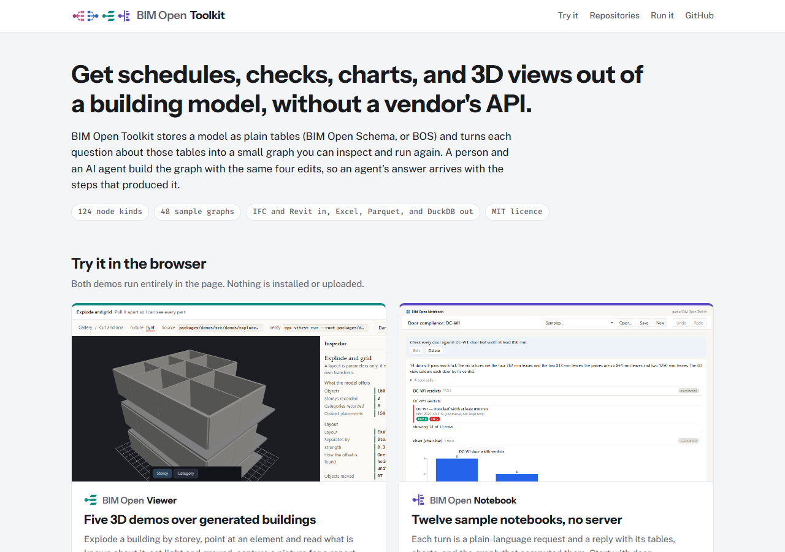

<p></p>

**Try it in the browser:** [the family page](https://ara3d.github.io/bim-open-toolkit/) links the [viewer's five 3D demos](https://ara3d.github.io/bim-open-viewer/) and [twelve sample notebooks](https://ara3d.github.io/bim-open-notebook/), both running with no install and no server.

BIM Open Toolkit gets schedules, checks, charts, and 3D views out of building models
without a vendor's API. It stores a model as plain tables (BIM Open Schema, or BOS) and
turns each question about those tables into a small graph that a person and an AI agent
build with the same four edits, so an answer arrives with the steps that produced it.

This repository is the hub of the BIM Open family and the analyst application: the
studio, the node packs that know about buildings, the samples over real models, the
headless checks, and the NRC (National Research Council Canada) research work. Since
2026-10-03 the products are being split into repositories of their own;
[docs/plans/repository-split.md](docs/plans/repository-split.md) has the phases and says
which code still lives here.

| | Repository | What it is |
|---|---|---|
|  | [bim-open-schema](https://github.com/ara3d/bim-open-schema) | The BOS specification |
|  | [bim-open-data](https://github.com/ara3d/bim-open-data) | BOS and IFC in .NET: read, write, mesh, convert to DuckDB, edit property sets byte-exactly |
|  | [bim-open-flow](https://github.com/ara3d/bim-open-flow) | Graphs over tables: node packs, headless host, web editor, MCP server |
|  | [bim-open-viewer](https://github.com/ara3d/bim-open-viewer) | WebGL viewer for building models, 17 npm packages |
|  | [bim-open-notebook](https://github.com/ara3d/bim-open-notebook) | A session with an agent kept as a document of results that can be evaluated again |

[](https://ara3d.github.io/bim-open-toolkit/)

[PROJECT.md](PROJECT.md) is the project brief: purpose, users, workflows, principles, scope, and how success is measured. New work is defined against one of its workflows.

## The problem it solves

BIM data is usually locked behind per-tool APIs, and the exchange formats that exist are
shaped for geometry interchange rather than analysis. Getting a column of numbers out of
a building model normally means writing against a proprietary API, in a proprietary
process, on a proprietary machine.

BOS stores the model as plain tables that load straight into DuckDB or Parquet tools.
BimOpenFlow turns questions about those tables into a graph of small pure functions:

```
  bos.load ──┬─► table.filter ──► table.aggregate ──┬─► chart.bar        (2D report)
             │                                      └─► sink.exportCsv  (ETL out)
             └─► view3d.instances ──► view3d.color ────► viewPane3D     (3D view)
```

ETL, 3D visualization, charts, SQL queries, and BIM queries are all the same kind of
graph, so they compose. The graph is a JSON document. Editing it means calling four
operations (`addNode`, `connect`, `setParam`, `removeNode`) that back the HTTP API, the
MCP tools, and every gesture in the editor. Nodes that write to disk run only inside an
explicit Run, so evaluating a graph for display never changes a file. Every run records
the graph hash and every input by content hash, so a number comes with a reproducible
derivation.

[docs/ARCHITECTURE.md](docs/ARCHITECTURE.md) explains the layers, the node packs, and
the design in detail. [docs/OVERVIEW.md](docs/OVERVIEW.md) is the one-page version.

## What it does not do

- It does not author or edit geometry. IFC editing is limited to property sets, written
  back byte-exactly.
- BimOpenFlow has no live connection to any authoring tool. Models arrive as IFC or
  BOS files; the Revit 2025 add-in under `plugins/` is how a BOS file leaves Revit.
- BOS is not built for ad-hoc queries on its own. The intended workflow is to load it
  into DuckDB and build wide views for the question at hand.
- The host is a single-user local process. There is no multi-user service, authentication,
  or hosted deployment.

## Prerequisites

- **.NET 8 SDK**, plus the **.NET 10 SDK** for the BOS Browser. The host, the IFC
  stack, the Revit add-ins, and the Browser target Windows, so the full toolkit builds
  and runs on Windows only. The engine group and the schema libraries target plain
  `net8.0`. Building the Revit add-ins needs no Revit install; the API comes from NuGet.
- **Node.js**, the version the installed Vite requires (`^20.19.0 || >=22.12.0`; older
  "Node 18+" advice is insufficient for the current viewer workspace), with npm, for
  the web editor, the 3D viewer, and the gates.
- **Git.** The graph system comes from `bim-open-flow`, the BIM data code from `bim-open-data`, the editor canvas from Gratify, and the 3D viewer from `bim-open-viewer`; `node deps.mjs` fetches them into `deps/`.

Run `node scripts/preflight.mjs` to check these, plus a .NET SDK and the private
Snowdon model the 3D and DuckDB demos need, before following the steps below.

## Start here

[docs/START.md](docs/START.md) is the one-page first run: a preflight check and
one command per service to a table graph over committed sample data, with no
private model required. The rest of this section is the same path in more detail.

## Build and run

```bash
git clone https://github.com/ara3d/bim-open-toolkit
cd bim-open-toolkit
node deps.mjs
```

`node deps.mjs` clones the dependencies listed in `deps.json` into `deps/` (the graph engine `ara3d-dataflow` among them), at the commits pinned there; `node deps.mjs --check` shows what it found.

```bash
dotnet build BimOpenToolkit.sln
```

Check the build by running the host smoke gate. It starts the host on a random port
with temporary directories, serves the node catalog, evaluates a graph, and records a run:

```bash
node gates/host-smoke.mjs
```

Start the host and the web editor together with one command, which builds the host,
launches both as detached processes, and prints http://127.0.0.1:5300 once they answer
(`--profile tables` uses the committed sample tables instead of `data/`):

```bash
node scripts/start-bim-flow.mjs
```

Or run the headless host by hand, pointing it at a directory of models:

```bash
dotnet run --project src/studio/BimOpenFlow.Studio -- --port 5214 --profile bim --models ./data
```

Run the web editor against it in a second terminal, then open http://127.0.0.1:5300:

```bash
npm install --prefix bimopenflow/web
```

```bash
npm run web --prefix bimopenflow/web
```

Build the two MCP servers into the folders that [.mcp.json](.mcp.json) launches, so a
Claude Code session opened in this directory connects to them. The command also reports
any server whose dll is missing (`--check` reports without building):

```bash
node scripts/build-mcp.mjs
```

Claude Code lists them as `bimopen-ifc` (questions about an IFC file) and
`bimopenflow-duckdb` (build and edit graphs in the DuckDB demo store). The skills in
`.claude/skills/` (`ifc-ask`, `bim-flow`) carry the schema notes, node syntax, and working
rules the Ask box's agent is given, so a chat in Claude Code starts with the same knowledge;
see [docs/bim-flow-mcp-demo.md](docs/bim-flow-mcp-demo.md).

The C# tests need fixtures that are not committed. Run `node deps.mjs`, then `./data/get-test-data.ps1`,
which copies them from a sibling clone as described in [data/README.md](data/README.md).
The sample analyses in `samples/` run without fixtures.

## Tested sets

The toolkit is built from eight other repositories, listed in `deps.json`, and each moves on its own schedule. A combination is known to work only once one commit of each has been built and tested together. `deps.json` records such a combination, and a tag on this repository marks one that passed every check below. Use a tag when you need code that does not change under you, for example in a paper's companion repository or in a fork.

Get a tested set:

```bash
git clone --branch v0.1 https://github.com/ara3d/bim-open-toolkit
cd bim-open-toolkit
node deps.mjs
```

`node deps.mjs` fetches every dependency at the commit the tag's `deps.json` pins, and `node deps.mjs --check` lists them. To consume the toolkit as a git submodule, check the submodule out at the tag (`git -C <submodule> checkout v0.1`), then run `node deps.mjs` inside it.

A tag is made only after these pass on a fresh clone, with no files outside the repositories: the Release build; `dotnet test` with the filter CI uses (`TestCategory!=RequiresTestData`), including the paper's checks in `BimOpenFlow.NrcWorkflows.Tests`; `gates/host-smoke.mjs`; `gates/web-smoke.mjs`; and, in `bim-open-notebook` at its pinned commit, its web and Pages smokes. `node deps.mjs --check` must print no warning, which means every repository in the set pins the same commits of the others.

| Tag | Date | Toolkit commit | Notes |
|---|---|---|---|
| `v0.1` | 2026-10-04 | see the tag | First set after the repository split: flow, data, viewer and notebook in their own repositories. |

`main` is where work happens and is not promised to be in a tested state between tags. To work across several repositories at once, put them side by side in a folder that holds a `.deps-root` file; `node deps.mjs` then links `deps/<name>` to the sibling checkouts instead of cloning, so an edit in one repository is seen by the others straight away (see [docs/plans/repository-split.md](docs/plans/repository-split.md)). No other repository may depend on this one; `DepsCycleTests` enforces that.

## Demos

The tables-profile demo in [docs/START.md](docs/START.md) needs no private model. The
two demos below show complete graphs end to end against a real building; both need the
private Snowdon sample model, and each has its own setup guide:

- **3D demo.** Colors, sections, and explodes a building model from an editable graph.
  Setup and troubleshooting are in [BIMOPENFLOW.md](BIMOPENFLOW.md).
- **DuckDB demo.** Nine SQL-backed schedule, join, and aggregation graphs over a typed
  Snowdon database. See [docs/bim-flow-duckdb.md](docs/bim-flow-duckdb.md).
- **Ask box.** The DuckDB demo's Ask box has an agent build a new graph from a
  plain-language request through the MCP tools. It needs an Anthropic or OpenAI key, or
  the Claude Code command line signed in (`node scripts/claude-login.mjs`; see
  [docs/claude-cli-login.md](docs/claude-cli-login.md)). See
  [docs/bim-flow-mcp-demo.md](docs/bim-flow-mcp-demo.md).

## Maturity

This is pre-release software under active development, assessed on 2026-09-13. Working
and covered by tests:

- The engine passes every conformance vector in `deps/ara3d-dataflow/spec/dataflow-graph/`, which is what
  makes it the canonical implementation of the spec.
- This repository's solution holds 12 NUnit test projects, for the BIM node packs, the
  studio, the samples, and the layering rules. The tests of the generic graph system
  and of the BIM data code run in `bim-open-flow` and `bim-open-data`, and the solution
  also lists their libraries from `deps/`.
- Two headless gates cover what unit tests cannot: a real host process over HTTP, and a
  full typecheck, test, and production build of every web and viewer package. See
  [gates/README.md](gates/README.md).
- Every sample analysis in `samples/` evaluates green over its sample data, enforced
  by a test.

Not yet covered: the publishing chain (dashboard, report, evidence package) has unit
tests but no end-to-end gate, and the demos depend on a private model that cannot be
redistributed. [docs/REPOSITORY-HANDOFF.md](docs/REPOSITORY-HANDOFF.md) is a fuller
assessment from 2026-09-08.

## Repository map

| Where | What |
|---|---|
| `deps/ara3d-dataflow/spec/dataflow-graph/` | The normative graph specification and its conformance vectors |
| `deps/bim-open-flow/` | The generic graph system, from [bim-open-flow](https://github.com/ara3d/bim-open-flow): the generic node packs, the host, the outputs, the flow MCP server (`BimOpenMcp.Flow`), the Ask loop, the editor's eight web packages, `contracts/`, and the tables samples; fetched by `node deps.mjs` |
| `deps/bim-open-data/` | The BOS reference implementation, the IFC stack, the IFC MCP server (`BimOpenMcp.Ifc`), and the BOS Browser, from [bim-open-data](https://github.com/ara3d/bim-open-data); fetched by `node deps.mjs` |
| `src/flow/` | The BIM node packs (`Nodes.Bos`, `Nodes.BimAnalysis`, `Nodes.Geometry`); the generic packs, host, MCP server, Ask loop, and editor packages are `deps/bim-open-flow` (from `ara3d/bim-open-flow`), and the engine is `deps/ara3d-dataflow` |
| `src/studio/` | `BimOpenFlow.Studio`, the host that composes the `bim` profile over bim-open-flow's generic host (`bimopenflow-studio`); `BimOpenMcp.Ifc.Ask`; and the Ara 3D Studio BIM scripts |
| `tests/` | NUnit projects mirroring `src/`, plus `BimOpenToolkit.Layering.Tests`, which fails on a reference that points up the layering |
| `plugins/` | The Revit 2025 add-ins: BOS exporter, Bowerbird host, samples, and `Ara3D.Revit.Utils` |
| `bimopenflow/web/` | The toolkit's web workspace: the studio's pages (`studio-web`) and the NRC pages (`nrc-web`: `nrc.html` and the sample-notebook page), over bim-open-flow's editor packages and the notebook and 3D pane (`pane-3d`) from `deps/bim-open-notebook`, all linked by `deps.config.ts` and `deps.tsconfig.json` |
| `deps/bim-open-notebook/` | The notebook and the 3D pane (`@bimopenflow/bim-open-notebook`, `@bimopenflow/pane-3d`), from [bim-open-notebook](https://github.com/ara3d/bim-open-notebook); fetched by `node deps.mjs` |
| `deps/bim-open-viewer/` | The standalone 3D viewer workspace, seventeen packages |
| `samples/` | Runnable sample analyses: BIM, NRC, Snowdon, 3D, and notebooks, with sample data (the tables samples are bim-open-flow's) |
| `gates/` | Headless integration smoke checks |
| `docs/` | Architecture, design decisions, demo guides, and the generated [node reference](docs/nodes.md) |
| `deps/bim-open-schema` | The BIM Open Schema specification: five dependency-free C# files and the sample `.bos` archives; fetched by `node deps.mjs` |
| `deps/ara3d-sdk` | The Ara3D SDK, built from source; `Directory.Build.targets` turns every `Ara3D.*` package reference into a project reference into it; fetched by `node deps.mjs` |
| `deps/` | Dependencies listed in `deps.json` and filled by `node deps.mjs`, not committed; the rows above, the engine, and the Gratify canvas UI library |
| `data/` | Test fixtures, not committed; populate with `./data/get-test-data.ps1` |

## Related projects

- [bim-open-schema](https://github.com/ara3d/bim-open-schema) holds only the schema's
  specification as code. This repository is its reference implementation.
- [ara3d-sdk](https://github.com/ara3d/ara3d-sdk) holds the general-purpose libraries
  (utilities, geometry, data tables, file formats, glTF export, the Bowerbird plug-in
  host, the MCP protocol). It is built from source through `deps/ara3d-sdk`. Everything
  specific to BIM authoring tools, Revit, IFC, or BOS lives here, not there.
- web-ifc parses IFC underneath the loader. DuckDB is the analytical engine on the far end.

## License

MIT.
