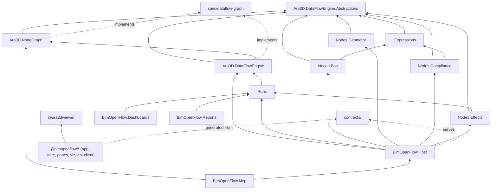

# BimOpenFlow — proposed project structure

> Proposal (Claude + Christopher Diggins, 2026-08-30). The from-scratch
> replacement for the PlatoFlow PoC (`platoflow/` remains reference material
> until deleted). Product name **BimOpenFlow** is provisional; every other name
> below is intended as final unless noted. Design inputs:
> `platoflow/docs/platoflow-design-principles.md` (P0 agent velocity, P1 one
> headless core) and `platoflow-graph-semantics.md` (analysis / graph / run
> vocabulary).

## Layering rules

1. Dependencies point downward only: spec ← engine ← node packs ← app.
   No BIM reference in or below `Ara3D.DataFlowEngine`; no pack-to-pack
   references between node packs.
2. The spec is the authority. The C# engine is the *canonical implementation*,
   proven by the conformance suite; any other implementation (e.g. a future TS
   preview evaluator) passes the same vectors or is wrong.
3. Shared types are generated from one source (`contracts/`), never hand-copied
   into TS and C#.
4. General-purpose projects (engine group, viewer) take only vendored SDK
   packages as dependencies and are candidates to graduate to `ara3d-sdk` /
   their own repos once stable. BIM-specific projects stay here permanently.

---

## Specification and contracts

### DataFlow Graph Specification
**Location:** `spec/dataflow-graph/`
The normative definition of the graph document format (structure + values
layers), evaluation semantics (dirtiness, memoization, standing evaluation),
and the run record. Written as markdown plus JSON Schemas plus a directory of
conformance vectors: input graph + inputs → expected outputs, consumed by the
conformance test project. No code and no dependencies; versioned with explicit
migration notes.
**Depends on:** nothing.

### Contracts
**Location:** `contracts/`
Single source of truth for app-level shared types: host HTTP API, pane
contract, node-catalog descriptors, and shared enums (the parameter-type enum
that fix-on-entry item 1 found hand-copied three times). JSON Schema / IDL
sources with a small codegen step emitting C# into the host and TypeScript into
`web/packages/api-client`.
**Depends on:** DataFlow Graph Specification (references its schemas).

---

## Engine group (C#, BIM-free)

### Ara3D.DataFlowEngine.Abstractions
**Location:** `src/Ara3D.DataFlowEngine.Abstractions/`
The node SDK: node and port interfaces, the value/table types that flow along
edges, capability declarations (pure vs. effectful, Run-gated), and the node
registry. Deliberately tiny and stable — it is the contract every node pack
compiles against, so churn here is churn everywhere.
**Depends on:** Ara3D.Utils, Ara3D.Collections, Ara3D.DataTable (vendored SDK).

### Ara3D.NodeGraph
**Location:** `src/Ara3D.NodeGraph/`
The graph *document* object model and the NodeGraph API: load/save/validate
per the spec, plus transactional editing operations (add/remove/connect,
undo/redo, structural validation against a node catalog). Knows nothing about
evaluation — it is what editors, agents, and the MCP surface manipulate.
**Depends on:** Ara3D.DataFlowEngine.Abstractions; Ara3D.Utils (vendored SDK).

### Ara3D.DataFlowEngine
**Location:** `src/Ara3D.DataFlowEngine/`
The canonical evaluator: dependency scheduling, memoization, dirty propagation,
and standing evaluation sessions that observers (panes, sinks) subscribe to.
Executes any registered node vocabulary over a NodeGraph document; contains no
I/O and no BIM.
**Depends on:** Ara3D.DataFlowEngine.Abstractions, Ara3D.NodeGraph;
Ara3D.DataTable (vendored SDK).

### Ara3D.DataFlowEngine.Expressions
**Location:** `src/Ara3D.DataFlowEngine.Expressions/`
The expression language used by derive/filter/what-if nodes: parser, type
checker, and evaluator over the table/value types. Pure and dependency-light
with a large test surface — ideal for an agent to own end-to-end.
**Depends on:** Ara3D.DataFlowEngine.Abstractions.

### Ara3D.DataFlowEngine.Runs
**Location:** `src/Ara3D.DataFlowEngine.Runs/`
The definition-vs-run split made concrete: freezing an evaluation into a run
record (graph hash + input hashes + outputs + timestamp), replay, and signing.
Runs are the only artifact archived or submitted as evidence, and the input to
both generators below.
**Depends on:** Ara3D.DataFlowEngine, Ara3D.NodeGraph.

---

## BIM node packs (C#)

### BimOpenFlow.Nodes.Bos
**Location:** `src/BimOpenFlow.Nodes.Bos/`
Source and query nodes over BIM Open Schema: model/parameter sources,
select/derive/aggregate via DuckDB, and unit-aware columns via the Harmonizer.
The workhorse vocabulary for takeoffs, audits, and analytics.
**Depends on:** Ara3D.DataFlowEngine.Abstractions,
Ara3D.DataFlowEngine.Expressions; Ara3D.BimOpenSchema,
Ara3D.BimOpenSchema.IO, Ara3D.BimOpenSchema.Harmonizer.

### BimOpenFlow.Nodes.Geometry
**Location:** `src/BimOpenFlow.Nodes.Geometry/`
Nodes that produce or transform 3D content for the viewer: mesh extraction,
coloring, isolation/explosion, massing, camera/view tables. The only pack that
touches meshing, keeping the geometry dependency (and its windows/x64 native
constraint) out of everything else.
**Depends on:** Ara3D.DataFlowEngine.Abstractions; Ara3D.Ifc.Mesher,
Ara3D.IfcLoader; Ara3D.Geometry, Ara3D.Models (vendored SDK).

### BimOpenFlow.Nodes.Compliance
**Location:** `src/BimOpenFlow.Nodes.Compliance/`
Verdict nodes: rule checks, pass/fail/needs-review rollups, and the check
metadata the compliance track hands to officials. Kept separate so the
evidence-bearing vocabulary has a small, auditable surface.
**Depends on:** Ara3D.DataFlowEngine.Abstractions,
Ara3D.DataFlowEngine.Expressions.

### BimOpenFlow.Nodes.Effects
**Location:** `src/BimOpenFlow.Nodes.Effects/`
All Run-gated sinks in one place: byte-exact pset write-back (via
Ara3D.Ifc.Editing), file exports (GLB, CSV, BOS), and report/dashboard
emission triggers. Isolating effects makes the purity rule enforceable by
project reference alone.
**Depends on:** Ara3D.DataFlowEngine.Abstractions, Ara3D.DataFlowEngine.Runs;
Ara3D.Ifc.Editing; Ara3D.IO.GltfExporter (vendored SDK).

---

## Application (C#)

### BimOpenFlow.Host
**Location:** `src/BimOpenFlow.Host/`
The headless host process: model catalog, graph store, conversion pipeline
(IFC → BOS), evaluation sessions, and the HTTP API defined in `contracts/`.
This is P1's "one headless core" as a deployable — the web app is strictly a
client of it.
**Depends on:** Ara3D.DataFlowEngine (+ Runs, Expressions), Ara3D.NodeGraph,
all four node packs; Ara3D.IfcLoader, Ara3D.BimOpenSchema.IO; contracts
(generated C#).

### BimOpenFlow.Mcp
**Location:** `src/BimOpenFlow.Mcp/`
The agent surface: an MCP server exposing graph authoring (via the NodeGraph
API), evaluation, and run retrieval. A thin adapter over the host — it holds
no logic of its own, so agents and humans manipulate graphs through the same
operations.
**Depends on:** Ara3D.MCP (vendored SDK); Ara3D.NodeGraph; BimOpenFlow.Host
(or its API client).

### BimOpenFlow.Dashboards
**Location:** `src/BimOpenFlow.Dashboards/`
The dashboard generator: turns a graph's output tables and views into a
self-contained interactive HTML dashboard (charts, tables, embedded 3D
snapshots) by binding run/session data to the prebuilt `web/packages/viz`
bundle. Live dashboards observe a running host; exported ones embed frozen run
data.
**Depends on:** Ara3D.DataFlowEngine.Runs; Ara3D.DataTable (vendored SDK);
contracts; the `viz` JS bundle (build artifact, not a project reference).

### BimOpenFlow.Reports
**Location:** `src/BimOpenFlow.Reports/`
The report generator: renders a run record into a static, archivable document
(HTML, printable to PDF) — the audit/compliance deliverable with verdicts,
provenance hashes, and evidence tables. Static by construction: a report never
requires a running host to read.
**Depends on:** Ara3D.DataFlowEngine.Runs; Ara3D.DataTable (vendored SDK);
contracts.

---

## Web (TypeScript, `bimopenflow/web/` npm workspace)

### @bimopenflow/app
**Location:** `bimopenflow/web/packages/app/`
The editor application shell: canvas editing on gratify, node catalog browsing,
pane docking, and session/run controls. Owns the `layout` and `session` layers
of a graph file; never evaluates anything itself.
**Depends on:** gratify (submodule); @bimopenflow/state, @bimopenflow/panes,
@bimopenflow/api-client.

### @bimopenflow/state
**Location:** `bimopenflow/web/packages/state/`
The client-side store and reducer: graph document mirror, selection, undo
integration with the NodeGraph API, and subscription plumbing for evaluation
updates. UI-framework-free so it is testable headless with vitest.
**Depends on:** @bimopenflow/api-client.

### @bimopenflow/panes
**Location:** `bimopenflow/web/packages/panes/`
The pane implementations — table, chart, 3D view, inspector, verdict list —
each an isolated module behind the single pane contract (data in, events out).
The most naturally parallel surface in the system: one agent per pane, zero
overlap.
**Depends on:** @bimopenflow/viz, @ara3d/viewer (3D pane only), contracts
(generated TS).

### @bimopenflow/viz
**Location:** `bimopenflow/web/packages/viz/`
Chart and table rendering components shared by the editor panes and the
dashboard generator, bundled as a self-contained artifact the C# generators can
embed. Keeping it separate is what lets dashboards look identical to the live
app.
**Depends on:** contracts (generated TS). No app/state dependency.

### @bimopenflow/api-client
**Location:** `bimopenflow/web/packages/api-client/`
The typed client for the host HTTP API, generated from `contracts/` — never
hand-edited. Includes the subscription client for standing-evaluation updates.
**Depends on:** contracts (generated TS).

---

## Viewer (TypeScript, general-purpose)

### @ara3d/viewer
**Location:** `viewer/`
The new WebGL viewer replacing `@ara3d/ara3d-webgl`, designed against the §5
item 7 lessons: `three` as a peer dependency, float numeric parameters,
per-instance color API, and loader progress reporting. BIM-free and
independently publishable; consumed by the 3D pane and by exported dashboards.
**Depends on:** three (peer). Candidate to move to its own repo once stable.

---

## Tests and gates

### Ara3D.DataFlowEngine.Conformance
**Location:** `tests/Ara3D.DataFlowEngine.Conformance/`
Runs every vector in `spec/dataflow-graph/conformance/` against the canonical
engine. This suite is the definition of "canonical" — it gates all engine
changes and doubles as the acceptance test for any future second
implementation.
**Depends on:** Ara3D.DataFlowEngine (+ Runs), Ara3D.NodeGraph; the spec
vectors as content.

### Unit test projects
**Location:** `tests/<ProjectName>.Tests/` (one per C# project above);
`vitest` co-located per web package.
Standard per-project suites; each lives inside its project's fence so parallel
agents gate their own work without touching a shared suite.
**Depends on:** their subject project only.

### Headless gates
**Location:** `gates/`
End-to-end smoke scripts (host up, convert, evaluate, dashboard/report
emission, editor smoke via headless browser) — the supervisor-run integration
gate, successor to the PoC's `tools/*.mjs`.
**Depends on:** BimOpenFlow.Host, @bimopenflow/app (running builds).

---

## Dependency sketch

## Build-order / wave implications

Wave 0 (serial, supervisor): spec first draft + contracts + Abstractions —
the three frozen surfaces everything fans out from. Wave 1 (parallel):
NodeGraph, Expressions, viewer, viz — no mutual dependencies. Wave 2: engine +
conformance, then Runs. Wave 3 (parallel): the four node packs + api-client +
state. Wave 4: host, panes, app. Wave 5 (parallel): Mcp, Dashboards, Reports,
gates.
