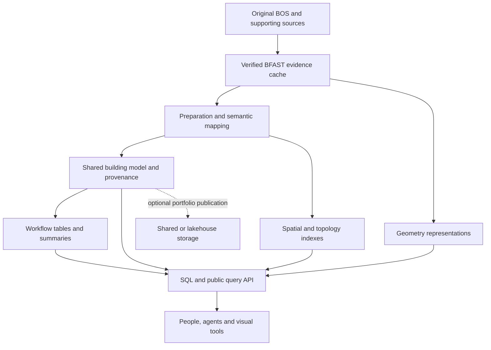

# Rethinking the BIM query platform

Planning proposal, 2026-09-06. This supersedes the previous in-memory snapshot as the proposed
production architecture. The earlier implementation remains a prototype and test reference.
This document proposes work; the new caches, schema and performance gates have not been implemented.

The logical schema now has a [review draft with JSON contracts, workflows and checked examples](contract/README.md).
It remains proposed; source mappings, prepared caches and performance gates are still outstanding.

## 1. The outcome we are designing for

A person should be able to open a prepared multi-building dataset, find the buildings, spaces,
systems and components relevant to their work, and get a useful answer without learning BOS
indices, property storage conventions, geometry buffers or database partitioning.

The model should support people estimating, designing, building, inspecting, operating and owning
buildings. Its organizing concepts should be recognizable: doors, roof areas, finishes, circuits,
equipment, rooms, material quantities, work packages, inspection findings and asset records.
Agents should use those same concepts and be able to explain where an answer came from.

**Recommended architecture:** a prepared, mostly immutable dataset with a shared semantic model,
denormalized workflow tables, and separately accessible geometry and graph indexes. Start with
local BFAST and embedded SQL; allow portfolio and shared-service backends without requiring them.
Richness belongs in the available data and queries, not in millions of eagerly allocated objects.

## 2. Confirmed constraints

| Requirement | Interpretation for this plan |
|---|---|
| Main stress dataset | `C:/data/nxt-bld/all-medium.bos`, containing multiple source documents/buildings |
| Conversion | Convert all BOS files under both supplied locations into a temporary BFAST cache; retain originals |
| Opening | Prepared data must open and return the first useful query result within **10 seconds** |
| Preparation | One-time BOS conversion and preparation of derived data are outside that opening deadline; measure them separately |
| RAM | **16 GiB ceiling on a 32 GiB workstation**, counting the BIM process and any workers, including resident mapped pages |
| Normal use | Remain well below the ceiling for browsing and selective queries; do not consume the allowance simply because it exists |
| Workload | Predominantly querying, understanding, visualizing and analyzing; updates arrive as occasional new deliveries |
| Source reliability | User identifies the Revit-derived Documents corpus as generally more reliable; IFC-to-BOS conversion is incomplete |
| Incomplete data | Supported explicitly; missing geometry, locations, quantities or links are ordinary states |
| Integration | Keep existing projects intact; new implementation stays isolated unless a small independently validated fix is needed |
| Engineering | Continue Platonic principles and compiler checks, with explicit, audited resource/IO boundaries |

The ten-second test includes useful data access, not merely constructing a memory-map handle.
Moving full hydration into the first property query would fail the intent of the requirement.
Large analyses have separate execution budgets; long-running analysis is not permission for slow
loading. Routine browse/filter/navigation queries must also have an interactive performance contract.

## 3. What inspection already established

The stress file is ZIP/Parquet and occupies 425,674,752 bytes. Bounded reads of its core Parquet
footers show 1,237,191 entities, 2,918,524 parameters, 42,033 descriptors, 224 documents, 1,015,215
strings and 33,617 numbers. Explicit relations, points and diagnostics each have zero rows.
Its geometry includes a vertex-table entry with an uncompressed size of about 781 MB and an
index-table entry of about 402 MB. These are serialized table sizes, not measured runtime RAM.

Recursive discovery found **467 BOS paths**, about 1.30 GB in total, across the supplied locations.
The per-source v0/v1 collections are important to understanding evolution and correspondence.
There are only 18 top-level files; a root-only conversion would miss most of the requested scope.

Existing nearby BFAST files are not interchangeable. One has matching core row counts; another
does not. Matching counts do not prove identical content. The current serializer also omits geometry
and the manifest, and its loader copies mapped buffers into arrays. The new prototype reader buffers
whole Parquet entries and then constructs expanded rows. Neither is the default foundation for
this redesign's loading path. See [the investigation record](INVESTIGATION.md).

These findings change our priorities:

- Determine how source relationships are actually encoded before defining graph reconstruction.
- Distinguish source entities, metadata, types, representations and physical occurrences before counting assets.
- Inspect strings, property definitions and values before deciding normalization rules.
- Address large single row groups and geometry buffers during cache conversion, not after memory fails.
- Treat source/document/building mapping as an investigation question, not a one-document/one-building assumption.

Use two complementary evidence tracks. The Revit-derived Documents corpus is the preferred
reference for investigating semantic richness and known relationships, subject to validation;
it is not assumed perfect. The IFC-derived collections drive stress, federation and incomplete-export
testing. A defect or omitted feature in the IFC converter must not narrow the proposed building
model or become an assumed truth about the building. Record exporter family/version when known,
known limitations and field-level evidence. Do not transfer Revit unit/storage assumptions to IFC
or assume that two unrelated buildings should contain identical fields.

## 4. The architecture to evaluate

The layers have different responsibilities:

1. **Source evidence:** lossless BFAST data, source identities and fingerprints. Fast inspection
   must not depend on repeated Parquet decoding. Raw information remains available when a semantic
   mapping is uncertain or a workflow needs something we did not anticipate.
2. **Shared semantic model:** durable object identity, source correspondence, buildings/places,
   components, materials, quantities, systems, classifications, relationships and evidence.
3. **Workflow tables:** readable, deliberately denormalized projections with a declared row meaning.
   They repeat useful context such as building, storey, room, trade and component description.
4. **Specialized query structures:** spatial indexes, connectivity, reusable geometry and prepared
   summaries. Their existence is visible in the catalog; consumers need not manage them manually.
5. **Public interface:** a query API and SQL definitions expressing the same domain meanings.
   Pagination, selection and streaming are default behaviors; full materialization is an explicit operation.

### Alternatives and why the recommendation is a hybrid

| Approach | What we should take from it | What would make us adopt more of it |
|---|---|---|
| Mapped binary/columnar dataset | Selective access, shared buffers, cheap reopening and explicit ownership | Baseline BFAST cache; benchmark access and copies, not the format's reputation |
| Embedded analytical warehouse | Typed SQL, joins, summaries and denormalized domain views | DuckDB is the first candidate for local semantic/workflow storage |
| Dimensional warehouse | Shared building/material/time/scenario dimensions and clearly defined measurement rows | Use for takeoffs, costs, carbon, delivery quality and portfolio metrics |
| GIS object-relational database | Coordinate systems, spatial identity, multiple representations and indexed candidate/exact predicates | Optional PostGIS backend for shared GIS workloads and operations it demonstrably supports |
| SQLite with spatial index | Small embedded catalog and selective disk-backed identity/spatial queries | Benchmark if a particular DuckDB index/query fails the memory or latency target |
| Lakehouse | Immutable snapshots, lineage, partitioned datasets and storage separate from compute | DuckLake or Iceberg when multi-project distribution, interoperability or shared storage warrants it |
| Property graph / semantic graph | Explicit topology, relation meaning, inference provenance and domain vocabulary alignment | Add a graph engine only for query patterns that outperform the simpler edge/index representation |
| General object graph / universal property pivot | Convenient on small examples | Retain only as bounded result projections, not the primary storage or open path |

DuckDB can execute larger-than-memory workloads, but some operations and allocations have limits;
its memory setting alone is not a process-memory guarantee. We must budget database, geometry,
mapped pages and application allocations together and measure the actual process peaks.
[DuckDB workload guidance](https://duckdb.org/docs/current/guides/performance/how_to_tune_workloads),
[memory guidance](https://duckdb.org/docs/current/guides/performance/oom).

GIS's indexed-bounds-then-exact-test pattern is useful for BIM. It does not make a bounds overlap
an exact clash, or make every spatial database a complete 3D solid engine.
[PostGIS indexing](https://postgis.net/workshops/postgis-intro/indexing.html).

DuckDB's documented R-tree is based on 2D bounds and has query/memory considerations; SQLite's
R-tree supports additional dimensions but its default coordinate precision needs attention.
Neither should be selected as the universal 3D index without stress-model measurements.
[DuckDB R-tree](https://duckdb.org/docs/current/core_extensions/spatial/r-tree_indexes),
[SQLite R-tree](https://www.sqlite.org/rtree.html).

Lakehouse ideas are valuable even for local files. DuckLake combines SQL metadata with immutable
data files; Iceberg provides snapshot-based consistency. We can adopt reproducible publication
and dependency tracking before committing to either infrastructure.
[DuckLake architecture](https://www.ducklake.select/manifesto/),
[Iceberg reliability](https://iceberg.apache.org/docs/1.7.1/reliability/).

Parquet remains a possible cold portfolio/interchange format. It is excluded from the repeated
BOS investigation/open path requested here. An Arrow adapter may later simplify exchange with
other analytical tools; it is not a replacement for the requested BFAST caches.
[Arrow memory-mapping explanation](https://arrow.apache.org/faq/).

### One logical model, selective physical databases

Start with one prepared semantic SQL database per dataset snapshot, organized into logical schemas,
plus BFAST evidence/geometry/index files. Put cost catalogs, environmental factors and other shared
references in separately versioned reference stores. Build portfolio summaries across published
snapshots rather than opening every building's meshes.

Do not make one independent database per profession. Roofers and estimators must share the same
roof identity and quantity definitions. Split stores only for demonstrated scale, deployment,
access-control or update-cadence reasons. A catalog binds their versions and keeps joins coherent.
Opening the portfolio catalog must not open or validate every source file individually. Published
catalog metadata provides discovery; selected dataset partitions are opened on demand.

## 5. The proposed human-facing model

The names below are candidate concepts, not a frozen list of C# classes or SQL DDL. Phase 3 will
test them against source evidence and concrete questions.

Their formal catalog is now [domains.csv](contract/domains.csv) plus [concepts.csv](contract/concepts.csv),
with explicit coverage status and links to defined table contracts. The [generated C# review view](contract/generated/BimDataModel.cs)
groups those records by domain and retains candidate concepts as commentary. See [generation and mapping rules](contract/GENERATION.md).

The [domain-design queue](contract/DOMAIN-QUEUE.md) now turns the broad concept inventory into practical user/workflow proposals, with explicit value hypotheses, record/view/facet/capability boundaries and a bounded first design wave. Its [selection method](contract/DOMAIN-DESIGN.md) prevents the inventory from automatically becoming an ever-growing class hierarchy.

| Domain | Candidate tables / concepts | Meaning |
|---|---|---|
| Identity and source history | Objects, SourceDocuments, SourceRevisions, SourceObjects, Correspondences | A real/logical thing is distinct from the source rows and representations describing it |
| Project and place | Projects, Sites, Buildings, Storeys, Spaces, Zones, SpatialMemberships | Recognizable locations; overlapping zones and multi-storey objects remain possible |
| Coordinates and representations | CoordinateFrames, Placements, GeometryRepresentations | Position/orientation, parent frames, 2D/3D shape and selectable detail |
| Building fabric | Walls, Floors, Ceilings, Roofs, Doors, Windows, Openings, Facades, Stairs, Railings | Common components with useful typed fields and spatial/contextual links |
| Structure and civil | StructuralMembers, Foundations, Connections, Terrain, PavedAreas, DrainageAssets | Structural and site objects; linear and surface features as well as solids |
| Interiors and landscape | FinishSurfaces, FinishLayers, Fixtures, Furniture, PlantingAreas, LandscapeAssets | Surfaces and assemblies that trades measure and specify |
| Systems and equipment | Systems, Equipment, Ports, Connections, Circuits, ServiceAreas | Connectivity, membership, flow/medium and service relationships are distinct |
| Materials and measurement | MaterialDefinitions, MaterialUses, Assemblies, QuantityObservations | Material contributions and quantities with explicit basis and provenance |
| Commercial and delivery | WorkPackages, TradeAssignments, EstimateItems, Rates, Deliveries, Milestones | A work item can concern multiple objects and may have no independent geometry |
| Operations and performance | Assets, MaintenanceRequirements, ObservationSeries, PerformanceResults | Stable assets plus links to operational records and scenario results |
| Environment and assessment | EnvironmentalFactors, ImpactResults, Assessments, Findings, Requirements | Versioned factors/rules and explainable results with incomplete/unknown outcomes |
| Flexible evidence | PropertyObservations, Classifications, Evidence, MappingDecisions | Preserve source detail and explain how curated values were chosen |

We should not require every row in these concepts to have a mesh—or require a physical mesh to
define its identity. A conceptual door, scheduled door and modeled door can describe the same
intended object once correspondence is established. An unmatched representation remains unmatched.

### Identity, location and evolving information

Use stable semantic identity plus explicit mappings to source/snapshot identities. Never merge
across documents just because a local ID, name or position matches. Record confirmed matches,
possible matches, conflicts and their evidence. Revisions should distinguish changed descriptions,
replacement objects, retired objects and objects absent from an incomplete delivery.

Separate spatial location from geometric representation. A component can have a known storey or
space, a 2D anchor, a local 3D placement, multiple geometries, or an explicitly unknown location.
Known placements reference a coordinate frame; unknown coordinates are not replaced with the origin.
Coordinate frames record units, axes, parent transforms and any known horizontal/vertical georeferencing.
Different IFC sources are not assumed aligned merely because they are federated into one file.

Nonspatial things—prices, inspections, work packages, systems—have identity and spatial associations
to the objects or areas they concern. They should not receive invented point locations.

Geometry representations can be points, centerlines, footprints, boundaries, surfaces, meshes or
solids. They have purpose, dimensionality, frame, provenance and detail/accuracy information.
Reuse shared prototypes with occurrence transforms. Separate a visual proxy from an analysis shape.
CityGML provides useful precedent for separating semantic objects from their representations;
we should borrow that idea without importing its entire schema.
[OGC CityGML](https://www.ogc.org/standards/citygml/).

### A definition of denormalization that serves people

Publish tables such as `DoorSchedule`, `RoofTakeoff`, `FinishSchedule`, `ElectricalEquipment`,
`StructuralMaterialTakeoff`, `DeliveryAudit` and `AssetRegister`. An ordinary row should contain
its building/storey/space, component description, relevant measures and units, classification,
source/quality status and links to the identified object.

These are governed projections of shared concepts. They can be stored, materialized selectively,
or exposed as views. Their readability does not require decoding unrelated properties, duplicating
meshes or loading an entire portfolio. Flexible source properties remain available behind them;
they are not the primary user-facing query vocabulary.

### Quantities and meaningful totals

Every fact table declares what one row measures. Examples: one material contribution to one
component in one snapshot; one estimate line for one package/scenario; one assessment of one
requirement against one subject. Do not join these at arbitrary granularity and then sum duplicated
values. This follows the dimensional-modeling emphasis on a declared row grain.
[Kimball grain](https://www.kimballgroup.com/data-warehouse-business-intelligence-resources/kimball-techniques/dimensional-modeling-techniques/grain/).

Preserve gross/net basis, unit/dimension, measurement method, source versus computed origin,
applicable revision and uncertainty. Distinguish volume, area, length, mass and count. A bounding-box
volume is not a takeoff quantity. Assembly totals, constituent quantities and repeated source
representations must not be added together blindly.

Cost and carbon computations need more than geometry: rates/factors, matching assumptions,
geography/date, currency, waste rules, life-cycle/scenario boundaries and provenance. Missing
inputs produce a visible incomplete result, not a zero or a fabricated fact. Totals should report
coverage and excluded/unknown quantities alongside the result.

### Cleanup, meaning and incomplete data

Separate original observations from canonical interpretations and selected workflow values.
Use an explicit mapping dictionary for property concepts, units, classifications, languages and
source conventions. Keep competing observations. Distinguish missing, not applicable, invalid,
conflicting, estimated, inferred and verified states where the workflow needs them.

Also distinguish **not exported**, **unknown due to converter limitations**, and **confirmed absent**.
Only make the latter claim when supported by the source/export contract or independent evidence.
Dataset origin informs confidence but does not establish every value's correctness. Mapping and
quality reports should separate source-model problems, exporter losses and our interpretation errors.

Do not equate string normalization with semantic identity. A string-valued boolean may be
interpretable, but parsing must follow a documented rule with the original value retained.
Unit conversion follows known storage semantics; display labels alone are insufficient.
Concept dictionaries should permit alignment with IFC, bSDD, trade classifications and organization
vocabularies. Alignment does not require making an external vocabulary our physical schema.
[buildingSMART dictionary structure](https://technical.buildingsmart.org/services/bsdd/data-structure/).

Topology needs its own evidence. System membership, physical connection, directional service,
spatial containment and proximity are different facts. The stress dataset's empty relation table
means graph extraction must first inspect entity-valued properties and source relation entities.
Any inferred link must retain its method and confidence; missing connectivity stays unknown.
Brick/ASHRAE topology modeling offers useful distinctions between equipment, ports and connections,
but does not supply geometry or recover missing source topology for us.
[Brick connection modeling](https://docs.brickschema.org/modeling/connections.html).

## 6. What to store and what to compute

| Strategy | Examples | Rationale |
|---|---|---|
| Preserve as source evidence | All BOS values and geometry, source identifiers, source manifest or its absence | Enables inspection, correction and reproducible remapping |
| Prepare and persist | Identity correspondence, classifications, typed common fields, placements, spatial bounds, property access indexes, verified topology | Avoid repeating expensive interpretation and whole-model scans at open time |
| Materialize selectively | Frequently used schedules, per-building/trade summaries, trusted quantities, graph components and audit coverage | Spend storage/preparation where measured workflows benefit |
| Compute per query | Filters, small joins, selected-object explanations, scenario arithmetic over prepared facts | Cheap, transparent and dependent on user choices |
| Run as explicit analysis | Exact geometric intersections, detailed egress analysis, simulations, large scenario sweeps | Expensive or dependent on policy/scenario inputs; cache reusable results with provenance |

All derived artifacts identify source snapshot, mapping policy and algorithm/schema version.
Publish a consistent generation atomically; do not combine new tables with stale indexes.
Rebuild only affected partitions when practical. Different interpretation policies can coexist
without overwriting the original observations.

## 7. Execution plan and decision gates

### Phase 0 — Establish scope and measurement

Produce a manifest for all 467 discovered paths, including version collections and the stress file.
Record format, size, source fingerprint and source/cache correspondence. Equal content may share
a cache artifact, while each source path remains accounted for. Do not infer equality from names,
file sizes or matching row counts. Record hardware/runtime/storage conditions for performance tests.

**Exit:** reproducible inventory, baseline timing/RAM measurements, precise opening/query scenarios,
and a temporary cache root agreed by configuration rather than hardcoded user-specific paths.

### Phase 1 — Build a complete, low-memory BFAST investigation path

Convert every inventoried BOS source into a versioned cache under a dedicated temporary root,
for example `%TEMP%/Ara3D/BosInvestigation`. A per-source package may separate core data, geometry
and indexes into coordinated BFAST files. Originals are read-only. Cache lifecycle operations
only manage files owned by this cache, and incomplete conversions are never published as valid.

Preserve all normalized tables, strings, geometry and source metadata. Keep UTF-8 strings and
offsets accessible without constructing every managed string. Validate named buffers and schema
versions. Support large ranges/segments rather than assuming every buffer fits a 32-bit span.
Unknown source tables must be preserved or explicitly block a claimed lossless conversion.

Use bounded conversion and disk spooling where needed. Large single Parquet row groups require
special attention: an API called “streaming” that allocates the entire archive is not acceptable.
Verify exact values/order and geometry coverage, with checksums/provenance recorded during preparation.
Normal opening validates prepared manifests cheaply; full source hashing is not repeated on every open.

Persist enough catalog and property/identity indexes for efficient source inspection. Open only
metadata and selected mapped ranges. Track mapped-view lifetimes; a disposed callback view cannot
back a long-lived borrowed reference. Existing BFAST files may be reused only after verification.

**Exit:** every source path has a verified cache or explicit failure record; no unexplained missing
files. `all-medium.bos`'s prepared cache opens and supplies the defined first result within ten
seconds and under the memory ceiling. No semantic redesign is allowed to depend on the old eager
object graph as its only inspection tool. Failed cache files must be resolved before calling the
all-files conversion complete.

### Phase 2 — Investigate the actual data through that fast path

Produce a data atlas with actual examples and counts: source documents versus buildings; entity
roles versus physical occurrences; category/type patterns; property concepts and value encodings;
units and frames; duplicate identities; geometric coverage; source relations and possible encoded
topology; quantity/material information; version-to-version change patterns; missing/ambiguous data.

For representative architecture, structure and MEP sources, trace a wall, roof, door, space,
electrical object and mechanical/plumbing object from source rows to the meanings a user needs.
If a kind is absent, document absence instead of inventing an example. Inspect the v0/v1 sets as
potential revision evidence without assuming their labels establish object correspondence.

Use the Revit corpus to establish representative rich examples and the IFC corpus to test which
information survived conversion. When matching original IFC files or known fixtures are available,
check selected facts against those independent sources. A BOS-to-BFAST round trip proves cache
fidelity to BOS, not the correctness or completeness of the upstream IFC export. Produce an
exporter-capability matrix and a separate converter-defect backlog; do not expand this phase into
rewriting the existing converter. Unsupported features must appear as data gaps in user-facing results.

**Exit:** an evidence-backed atlas, query examples, and a mapping backlog distinguishing directly
available, safely derivable, externally supplied and unavailable information. This phase should
answer technical data questions independently; user input is reserved for intent and policies.

### Phase 3 — Define the semantic contract around workflows

Use [the workflow catalog](WORKFLOWS.md) to select at least eight contrasting acceptance stories:
trade takeoff, estimating, interiors, delivery audit, MEP tracing, egress screening, asset handover
and portfolio/environmental reporting. Selection is for validating design breadth, not excluding
other professions. Build small complete examples of the expected tables, answers and explanations.

Specify identities, coordinates, incomplete states, property selection, topology meanings, fact
grain and quantity definitions. Identify which external data each workflow needs. Produce a
human-readable data dictionary and representative SQL independent of a particular C# API.

**Exit:** the schema explains the representative questions without forcing users into raw EAV
joins or implementation details, preserves ambiguities, and prevents obvious double counting.

### Phase 4 — Compare a few physical designs on the stress data

Benchmark prepared DuckDB semantic tables/views plus BFAST geometry/indexes as the baseline.
Compare compact mapped indexes and, where justified, SQLite spatial/lookup storage. Test a graph
engine only against a difficult actual graph query. Compare server/lakehouse deployment through
representative portfolio workloads if local files prove insufficient; do not build every backend.

Measure opening, selected-object explanation, filtered schedules, grouped quantities, spatial
candidate queries, graph traversal and one broad aggregate. Include SQL and API paths. Limit
thread/query concurrency and result sizes. Count native memory and resident maps, not just GC bytes.
Pin candidate library/extension versions and verify their actual capabilities: current online
documentation is research evidence, not proof that the repository's older package version supports
every described feature. Keep any dependency experiments isolated from existing projects.

**Exit:** an architecture decision record with measured alternatives, storage/preparation costs,
peak RAM and latency. Choose the simplest combination that satisfies the contracts.

### Phase 5 — Deliver the semantic core and first workflow tables

Build the shared identity/place/component/material/quantity model and the first denormalized
workflow tables. Add classification/mapping policy versions, evidence lookup and quality coverage.
Persist only expensive reusable derivations. Avoid full-model object allocation, universal pivots,
unbounded property lists, eager string decoding and graph/spatial index rebuilding at open time.

**Exit:** the selected acceptance stories return correct, explainable SQL results on fixtures and
meaningful results or explicit data gaps on the stress dataset, within agreed resource budgets.

### Phase 6 — Add the public bridge and broaden validation

Expose discovery, typed filters, bounded tables, topology/spatial queries, selected geometry and
answer provenance through a C# API over the same semantic definitions. Use immutable bounded
results; keep IO, mapping ownership and any mutable performance kernels explicit under Platonic.

Validate that SQL and API answers agree. Add representative visualization handoffs, scenario
inputs and optional portfolio publication. Test cache invalidation, interrupted preparation,
new deliveries, schema evolution and reproducible analysis results.

**Exit:** documented human/agent examples, classified tests, performance evidence, and a deployment
story. Keep the earlier prototype and useful fixtures until replacement parity is established;
do not rewrite unrelated projects.

## 8. Performance and correctness acceptance

| Test | Required behavior |
|---|---|
| Prepared source inspection | Within 10 s: open catalog, list source documents/buildings where known, and retrieve a selected object's source properties |
| Prepared semantic opening | Within 10 s: discover workflow tables and return a representative filtered/paged result, including its context |
| Resident memory | Peak combined BIM-process/worker resident memory stays below 16 GiB; track private committed memory separately and keep it within budget too |
| Repeated browsing | No accumulating mapped views, growing retained object graphs or unbounded result caches |
| Cold versus warm | Report process-cold and warm runs separately; identify OS-cache state honestly. No warm-only claim of general compliance |
| Startup dependencies | No Parquet decoding, geometry derivation, global string expansion or complete graph build hidden in startup/first interaction |
| Measurements | Record wall time, first-result latency, peak working set, private bytes, allocated bytes, bytes read and page faults where available |
| Fidelity | Source/cache value checks, counts/order, geometry/transform coverage, Unicode, missing values, large-buffer and legacy-layout fixtures |
| Semantic correctness | Identity nonconflation, frame correctness, quantity units/basis, topology meaning, coverage and no repeated-source/assembly double counting |
| Exporter limitations | Missing-export fixtures do not become zero quantities, disconnected-network claims, absent elements or false audit passes; compare selected facts to independent originals where available |
| Query equivalence | SQL and API results match; spatial index answers checked against independent bounded oracles; candidate versus exact status is explicit |
| Recovery/evolution | Interrupted conversions do not become valid caches; changed inputs/policies invalidate dependent products; snapshot joins stay consistent |

For the fixed benchmark workload, any measured open beyond ten seconds fails the gate; also report
median and tail latency rather than hiding failures in an average. Formal cold-cache validation
must use a controlled environment, not disruptive cache-clearing on the user's workstation.
The supplied corpus may fit partly in OS cache; use constrained/controlled runs to validate claims
about a 32 GiB machine. Performance tests are separate from small correctness tests and are not
silently skipped because a required stress source is absent.

Use independent categories for feature, scale, source, preparation/open/query, cache state and
maturity. Run cheap deterministic tests frequently; run large gates when storage/index/schema
changes affect them. Preserve logs and reports; do not turn observational samples into claims
that every source fact is semantically correct.

## 9. Decisions fixed now and decisions left to evidence

Fixed: the ten-second prepared-open gate, 16 GiB ceiling, BFAST investigation caches for every
supplied BOS source, human/workflow-oriented semantics, explicit identity/location/representation,
incomplete-data support, provenance, inspectable SQL, bounded access and mostly immutable publication.

Recommended but subject to measurements: DuckDB as the local semantic store, one logical model
with multiple workflow schemas, persisted compact spatial/topology indexes and an optional
portfolio publication layer. Dedicated graph services, PostGIS, SQLite indexes and a lakehouse
format are alternatives with specific adoption triggers, not mandatory dependencies.

Remaining user choices concern policy rather than facts we can investigate: regional vocabularies
and measurement conventions, preferred rate/EPD/reference datasets, jurisdiction-specific audit
rules, and how selected workflows should communicate estimates or uncertainty. These need not
block the BFAST foundation or data atlas. The broad profession/workflow coverage is already a
requirement; the next step is to prove its shared concepts against evidence, not narrow it away.
