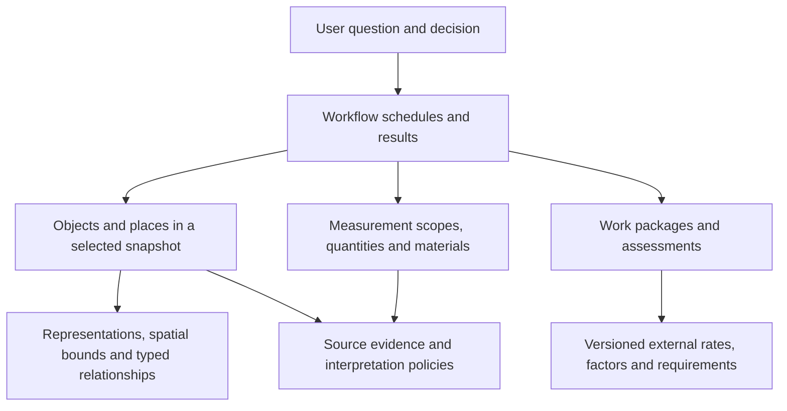

# Human-facing BIM contract — review draft

Version **0.1.0-review.1**, 2026-09-06. Proposed semantics, not a production schema or a claim that the supplied BOS files populate these fields.

The PLAN's domains and candidate concepts are now formalized in compact CSV catalogs. A [single generated C# review file](generated/BimDataModel.cs) presents the table records, typed keys and documentation. See [the authoring and generation guide](GENERATION.md).

The missing trade-facing models now have a [prioritized domain-design queue](DOMAIN-QUEUE.md), backed by [hierarchical JSON with user/workflow tags](domain-models.json). Read [the selection method](DOMAIN-DESIGN.md) for the value rubric, model boundaries and eight-item active design limit. These candidates are not automatically added to the generated C#.

The recommendation is to keep **workflow descriptions and the data contract together, with checked references between them**. Workflows explain why information belongs in the model. The schema defines the shape of that information. Neither document should mechanically generate the other: deciding that two roof measurements are alternatives, or that a wall has two independently finished faces, requires domain judgment.

## Start the review here

1. Read a question and its intended decision in [workflows.json](workflows.json). Challenge whether it reflects how someone actually works.
2. Inspect its `requiredFields`, `outputTables`, counting basis and missing-data behavior. The steps are explanatory pseudo-code, not executable instructions or a new query language.
3. Inspect the relevant table's **grain** in [model.catalog.json](model.catalog.json): exactly what does one row represent?
4. Inspect its fields in [model.schema.json](model.schema.json), then the corresponding [synthetic example](examples/scenarios.json).
5. Change the documents and example together, then run the checks below. A passing check establishes consistency of this draft, not correctness of a building model.

The catalog contains 23 table contracts. The workflow document describes 31 roles and 20 workflows: eight worked through in detail and twelve candidates. “Detailed” means sufficiently explored for review; MEP path results and navigable egress topology are still not fully contracted.

## Why this approach, and where it can fail

| Approach | Useful property | Problem for this project | Decision |
|---|---|---|---|
| Narrative design document alone | Easy discussion of intent | Fields, examples and terminology drift without detection | Keep narrative, add checked artifacts |
| C# records as the master schema | Familiar and compile checked | Language choices can determine semantics too early; records do not establish relational grain or evidence rules | Map bounded results into C# after semantic review |
| SQL DDL as the master schema | Concrete tables and joins | A storage decision would precede decisions about meaning, incomplete facts and workflows | Derive storage mappings later |
| Generate the schema from natural-language workflows | Apparent traceability | Similar words can hide different quantities, scopes and counting rules; generated tables can proliferate by role | Workflows justify and test the contract; humans resolve semantics |
| One enormous denormalized table | Simple first query | Multiplies rows across materials, spaces, representations and observations | Shared facts plus purpose-specific schedules and result tables |
| JSON Schema plus semantic catalog and examples | Inspectable, language independent, structurally verifiable | More than one artifact must stay consistent; JSON Schema cannot prove domain truth | Adopt provisionally, with cross-document checks |

JSON Schema Draft 2020-12 provides the structural vocabulary used here. References and `$defs` let record shapes share definitions without embedding storage decisions. The companion validator handles selected cross-record rules; foreign-key integrity and correct takeoff arithmetic are not consequences of JSON Schema validation. The runner explicitly enables format checking for reference dates. See the official [validation specification](https://json-schema.org/draft/2020-12/json-schema-validation) and [schema structuring guide](https://json-schema.org/understanding-json-schema/structuring).

There are four distinct kinds of statement in this package:

| Artifact | Authority in this draft |
|---|---|
| `model.schema.json` | Machine-checkable row shapes, value alternatives, required fields and some conditional constraints |
| `model.catalog.json` | Proposed meanings, primary/foreign keys, evidence coverage, counting rules and unresolved policies |
| `workflows.json` | User decisions, illustrative steps, information requirements and review examples |
| `examples/scenarios.json` and tests | Synthetic examples of intended answers and rejection of specific misleading cases |

`catalog.schema.json` and `workflows.schema.json` validate the documents themselves. Custom catalog properties are metadata consumed by the companion checks; they are not invented JSON Schema validation keywords. Each JSON file remains directly editable. The C# review view is generated from these definitions and the CSV catalogs; there is no executable workflow DSL.

## The proposed information model

People enter through schedules, takeoffs, asset records and assessments. Shared identities, evidence and observations let different tools agree about what their answers refer to.



| Concepts / tables | What one row means, and why it exists |
|---|---|
| `objects`, `object_states` | Identity of a physical, spatial or logical thing; its description in one delivery. A building, a room, a pipe and a system have identities without pretending they are all countable components. |
| `snapshots`, `source_records`, `source_links` | A selected set of deliveries; locators for original records; evidenced correspondence assertions. One document need not equal one building. |
| `coordinate_frames`, `representations`, `spatial_bounds` | Declared frames, alternative geometry and cheap spatial envelopes. Geometry is optional; multiple representations still describe one object. |
| `relationships` | A typed, directed assertion such as containment, service or connection, with accepted/candidate/rejected status. A spatial candidate is not a proven connection. |
| `property_observations` | A typed observation of a named concept, preserving alternatives rather than silently overwriting them. Concept vocabulary and selection precedence need further review. |
| `quantity_scopes`, `quantity_observations` | A whole object, material part or surface being measured, and alternative measurements of that subject. Two layers can each have a selected mass; two competing measurements of one layer cannot both be selected in the same context. |
| `material_contributions` | A material's contribution to an object, linked to the relevant measured quantity and accounting scope. Whole assembly totals and constituent quantities are not automatically additive. |
| `reference_sets` | A named edition of external rates, environmental factors, requirements, vocabulary or manuals. These inputs are not assumed to come from BOS. |
| `work_packages`, `assessments` | A declared scope of work, or an assessment of a subject against a particular requirement and scenario, including unknown results. |
| `component_schedule`, `door_schedule`, `roof_takeoff`, `finish_schedule` | Human-facing projections at useful grains: physical occurrence, door, roof occurrence and finish face. Names, locations and selected facts are repeated deliberately. |
| `estimate_lines`, `impact_lines`, `asset_register` | Priced or unpriced scope, material impact under an explicit factor/scenario/module, and maintainable assets including incomplete handover evidence. |

Roles describe interests, not permissions or database partitions. An estimator, roofer and sustainability analyst may use the same roof identity with different measurements and external inputs. The contract leaves physical tables versus SQL views versus prepared partitions undecided. It also leaves room for specialized domain projections rather than forcing every engineering concept into property rows.

## Two questions that expose the design

**“How much roofing membrane should we bid for, by building and assembly, and what scope is still unmeasured?”**

```text
Within the requested snapshot and building scope:
  take each distinct roof occurrence;
  select the applicable net surface measurement for its measurement scope;
  group known quantities by building, assembly and compatible unit;
  return known area together with unmeasured and conflicting scope;
  apply waste and rates only in an explicit estimating scenario.
```

The example contains a roof with 120 m2 of surface area, 100 m2 of projected area and an alternative surface measurement of 125 m2. The selected takeoff is 120 m2. Another roof remains unmeasured. The estimate example prices the known scope at 10 CAD/m2 with 10% waste, yielding a **1320 CAD partial subtotal**, not a complete bid.

**“Which rooms are served by this air-handling unit, and how trustworthy is that answer?”**

```text
Within the selected snapshot:
  traverse accepted relationships with the requested service meaning;
  keep the supporting relationships for each returned object or space;
  exclude proximity candidates from the connectivity traversal;
  report missing topology coverage separately from an empty reachable set.
```

The example establishes a supported path through a duct to a room. Nearby equipment does not join that path. An empty or partial export cannot establish that equipment is disconnected. The eventual path/coverage response needs its own schema; the draft does not disguise generic edges as a finished graph-query API.

## Incomplete data and evidence are part of the answer

Important facts have either an available value with evidence and assurance, or an explicit unavailable state with a reason. For example:

```json
{
  "state": "not_observed",
  "reason": "No net roof-area observation is supplied.",
  "evidence": {
    "origin": "source",
    "sourceRecordIds": ["src-roof-unknown"],
    "referenceSetIds": [],
    "method": "synthetic-fixture-observation-v1"
  }
}
```

The states distinguish `not_observed`, `not_exported`, `not_applicable`, `invalid` and `conflicting`. Use `not_exported` only when exporter capability evidence supports that diagnosis. Unknown causes remain `not_observed`. A real zero is an available measured value. `null` is permitted for optional locators or labels, such as an unmatched rate-item ID; it does not stand for a measured zero.

A finish with no known room association remains a finish record. An unpriced line can have no matched rate item. An incomplete impact calculation can have no matched factor. A door assessment cannot have `result: pass` with incomplete inputs. These are structural and example-level protections, not automatic certification of evidence or compliance.

Unknown location does not become the project origin. A location can refer to places, a 2D/3D pose in a declared frame, or both. Spatial bounds support candidate filtering in a resolved common frame; they do not provide an exact clash, roof area, solid volume or navigable egress route.

## Findings versus hypotheses

The stress-file inspection found 224 document rows and 1,237,191 entities, with no rows in the explicit Relations table. These observations do not identify the number of buildings or physical objects, and do not establish that relationships are absent. The user identifies the Revit-derived Documents corpus as generally more reliable and the IFC converter as incomplete. [The investigation record](../INVESTIGATION.md) preserves those distinctions.

Accordingly, the catalog labels source structure observations, unverified mappings, proposed derived data and required external inputs separately. All 93 example records here are invented. They have not been extracted from, or matched against, any supplied BOS file. Matching a schema is not evidence that an exporter supplies a field.

## Representation, scale and C#

JSON is the **review and interchange representation**. `model.schema.json` validates one `{ "table": ..., "row": ... }` envelope. It is not a mandate to serialize or load the entire dataset as a JSON object graph. The example pack is a small test container, not a production package format.

Amounts use decimal strings and explicit units to make values unambiguous in review. Database numeric types, precision, unit conversion and currency rounding need separate mappings. The current unit and kind vocabularies are a deliberately limited first edition, not a claim to encompass every engineering discipline. Extend them through reviewed versions instead of falling back to untyped property bags for every new need.

After grains and value semantics are accepted, the same logical contract can map to SQL columns/views, columnar prepared data and bounded C# result records. For example, an available-area object may map to amount, unit, availability and evidence columns. Immutable C# records or readonly value records are plausible result types; a one-record-per-source-entity heap is not implied. Geometry payloads and graph indexes can remain separately addressable.

The prior plan's performance contract remains: prepared open **including the first useful query within 10 seconds**, and a **16 GiB process budget on a 32 GiB workstation**, including native memory, workers and resident mapped pages. One-time conversion/preparation is separate. This package does not measure or meet those performance gates. Source profiling and bounded preparation experiments must run alongside semantic review before choosing materializations or a graph engine.

## What changed through dogfooding

The initial review exposed missing spatial envelopes, insufficient measurement scope for material layers, inability to represent an unassigned finish, and fabricated identifiers for unmatched rates. The draft now has explicit bounds and measurement scopes, availability-aware finish associations, and nullable unmatched reference locators. Regression cases exercise those decisions. The agent critique also identified the need to check that an estimate's quantity belongs to its work package; that check is included.

This illustrates the intended process: write a useful question, construct an awkward example, attempt the answer, then revise the grain or value contract where it fails. Prefer these concrete counterexamples over adding speculative fields.

## Decisions still needed

1. **Scope identity and overlap.** Measurement subjects are now explicit, but the draft cannot prove that two material parts or split work packages are disjoint. Surface and part correspondence across deliveries needs a policy and evidence.
2. **Resolvable provenance and scenarios.** Source revisions, external reference items, scenario inputs and policy editions need addressable contracts before preparation can be replayed or rates/factors fully audited. Current identifiers name them without providing a complete registry.
3. **Measurement conventions and authority.** Select governing conventions, precedence among source/derived/estimated observations, and initial rate/factor/requirement libraries. Conflicting measurements must not default to first-row-wins.
4. **Human-facing results.** Decide how to express partial-result coverage, warnings, paths and aggregations. The eight detailed workflows do not yet imply eight fully specified service endpoints.
5. **Domain depth.** Navigable egress, time series/building performance, electrical/fluid design, construction progress and landscape specifics need dedicated refinements. They remain candidates or explicitly deferred concepts, not promises hidden in a generic table.
6. **Vocabulary and units.** Establish concept identifiers, display labels, unit conversions, rate rounding and extension/versioning rules before generated bindings or migrations become authoritative.

Define and review the key logical objects **now**, alongside bounded source investigations. Freeze a first implementation slice only after its example answers, missing-data behavior, source mapping and resource budget have been demonstrated. This avoids both premature physical design and waiting for exhaustive source archaeology before discussing useful concepts.

## Validation and Platonic.CSharp

See [VALIDATION.md](VALIDATION.md) for executed checks, their limits and reproducible commands. Tests are categorized by feature, small size and review maturity. They validate all schemas, cross-document references, all example rows, selected relational/semantic invariants and the eight example answers. They do not execute the pseudo-code.

Platonic's emphasis on explicit inputs, immutable values and checked boundaries informs the proposed snapshot and result semantics. Its C# analyzers do not apply to JSON or these Python review tools. Existing C# integration is described in [the prototype integration summary](../../../../src/Ara3D.BimOpenSchema.DataModel/PLATONIC-INTEGRATION.md). The generated C# review view now compiles in an isolated project using that same analyzer integration, including a negative check proving enforcement. See [GENERATION.md](GENERATION.md).
