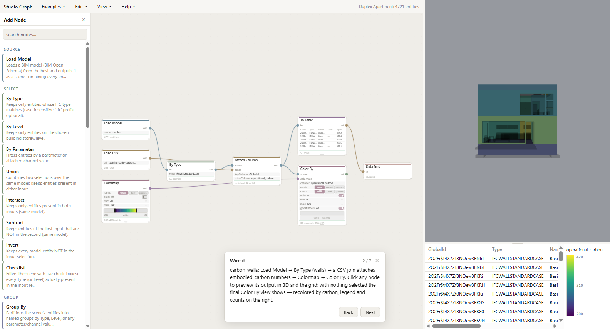

# Studio Graph (PlatoFlow PoC)

Studio Graph is a browser-based dataflow editor for building models. You wire nodes on a
canvas — load a model, filter it, join a spreadsheet, run a SQL query, pick a color ramp —
and the connected 3D view, data grid and legend update live as you edit. It is a proof of
concept built to test the ideas in the PlatoFlow × IFC design
(`docs/platoflow-ifc-design.md`) before the real implementation starts.

**Maturity: throwaway prototype.** Built 2026-08-09, extended through 2026-08-20. Nothing
here is load-bearing; the code exists to answer design questions, and the answers live in
[NOTES.md](NOTES.md), which is as much the deliverable as the demo. It is for developers on
the Ara 3D team evaluating the design, not for end users.



## The problem it explores

BIM analysis today means either clicking through a viewer (no way to record or replay what
you did) or writing a script (no way to see intermediate results, and nothing a
non-programmer can modify). A dataflow graph sits between the two: every step is visible,
every step's output can be inspected, and changing one parameter re-runs only what depends
on it. The open questions this PoC was built to answer: can the interactive tier (recoloring,
filtering, scrubbing a slider) run entirely in the browser with no server round-trip; can an
AI agent build a useful graph over a live session; and can computed results be written back
into the source IFC file without disturbing the rest of it.

## What it does not do

- It is not the real product. The code is unoptimized and will be discarded; only the
  design findings carry forward.
- It does not scale to large models. Recoloring rebuilds the merged geometry, which measured
  at roughly 7 µs per instance — fine at the 20,000-instance scale of the sample models,
  estimated ~2 s (unusable for a slider) at 300,000 instances. The fix (per-instance color
  buffers) is a design note, not implemented here.
- It has no persistence beyond named graph JSON files, no undo history across reloads, no
  multi-user story, and no authentication of any kind.
- It does not author or edit IFC geometry. The one write path adds property sets to an
  existing IFC file byte-exactly; everything else is read-only analysis.

## How it works

Two processes, talking over HTTP on localhost:

**The web app** (`web/`, Vite dev server on port 5215) owns everything interactive. The node
editor is drawn on a canvas by [gratify](../submodules/gratify), an in-house immediate-mode
UI library; node cards show their own parameters, status and mini-previews, so there is no
separate inspector panel. The evaluator (`web/src/flow/`) is plain TypeScript running in the
browser: when the graph changes, it re-runs the affected nodes and hands the results to a
three.js viewer (via `@ara3d/ara3d-webgl`), a data grid and a legend. Clicking a node shows
its output in 3D and in the grid; with nothing selected, the last view-producing node shows.
34 node kinds are declared in `web/src/kinds.ts`, grouped into sources, selections, grouping,
data, tables, views, visualization and sinks.

**The host** (`host/`, a C# .NET 8 program on port 5214) does what a browser cannot. On
first start it converts the sample IFC files to BIM Open Schema (BOS) — a columnar format
the ara3d-sdk produces — and caches the result in `data/` (the first conversion takes about
45 seconds; later starts reuse the cache). At run time it serves the model files, executes
SQL queries against DuckDB views over the model (`POST /api/sql`), stores and lists named
graphs, patches property sets into IFC files, and exposes the whole session to AI agents as
a Model Context Protocol (MCP) endpoint at `http://127.0.0.1:5214/mcp` — an agent can list
node kinds, add nodes, connect them, set parameters and load graphs, and the canvas updates
as it works. The host is not required for editing: with it down, the app falls back to the
static demo files and disables SQL and write-back.

The seam between the two is documented in [CONTRACTS.md](CONTRACTS.md): the value types that
flow along wires (scene, table, colormap, view), the host HTTP API, and the write-fence
tables used when parallel agents work on this tree.

## How to run it

Prerequisites: Windows (the host targets `net8.0-windows` and carries a native IFC library),
the .NET 8 SDK, and Node.js 18 or newer (developed on Node 22). This project lives in
`wip/` inside the `ara3d-sdk` repository, and the host reaches its dependencies by relative
path, so it builds from a normal checkout of that repository. The web application is the
exception: it aliases the `gratify` canvas library from `submodules/gratify` in the
enclosing `studio` superproject, so `npm run dev` needs the full `studio` checkout with its
submodules, not `ara3d-sdk` on its own. Moved here from `studio/labs/platoflow-poc` on
2026-08-20.

```bash
dotnet run --project host
```

```bash
cd web && npm install && npm run dev
```

Open http://localhost:5215. Pick an example from the **Examples** menu (they load
auto-tidied and framed), or take the guided tour under **Help ▸ Run walkthrough…**. To
verify the host is up, the status bar shows the loaded model and entity count (for example
"Duplex Apartment: 4721 entities"); `GET http://127.0.0.1:5214/api/health` answers too.

Checks, all run from `web/`:

```bash
npm run check
```

```bash
npm test
```

As of 2026-08-20 that is a clean TypeScript check and 997 passing tests in 50 spec files.
`node tools/intgate-smoke.mjs http://localhost:5215/` runs an end-to-end check (~13
assertions: the 3D pane paints, and each host-touching feature — SQL, property-set write,
MCP intents, Ask AI — round-trips once) in a private headless Chrome, because the shared
browser pane freezes background tabs (see NOTES.md). `host/smoke.ps1` covers the host alone. Two harness pages isolate the halves:
`/editor.html` (editor with mock data, no host) and `/viewer.html` (viewer alone).

## How to extend it

**Add a node kind.** Two files: declare the kind in `web/src/kinds.ts` (label, category,
input/output ports, parameter schema, description — this drives the card, the palette and
the tooltips), then register its evaluator with `def("your.kind", ...)` in the matching
`web/src/flow/defs-*.ts` file. Evaluators are pure async functions from inputs and
parameters to a value plus a status; they touch the host only through the `EvalCtx`
interface, which is what keeps them testable — the specs in `web/src/flow/tests/` run them
headless with mock contexts. If the node needs an interactive body (like the colormap's
embedded ramp slider), see `web/src/editor/colormap.ts` for the pattern.

**Add an example.** Drop a graph JSON file in `demo/` (copy an existing one; the shape is
`{ name, nodes, edges, display }`) and add its name to the `demos` list in
`web/src/main.ts`. Node positions in the file no longer matter — examples are auto-laid-out
on load.

**Change the look.** The canvas palette lives in `web/src/theme.ts` (gratify design tokens)
and the DOM side in the `--pf-*` CSS variables declared in each HTML page; the two carry the
same values by convention.

**Drive it from an agent.** Point any MCP client at `http://127.0.0.1:5214/mcp`. The tools
are `list_node_kinds`, `get_graph`, `add_node`, `connect`, `set_param`, `set_display`,
`load_graph`, `read_node` and `sql`. Intents queue on the host and the browser applies them
within ~300 ms.

**Record what you learn.** Findings — design friction, performance numbers, API warts — go
in [NOTES.md](NOTES.md). For this project that file outlives the code.

## Layout

| Path | What it is |
|---|---|
| `web/src/editor/` | Canvas node editor: cards, wires, palette, context menu, chrome, layout |
| `web/src/flow/` | Node evaluators and the graph evaluation engine (browser-side, pure TS) |
| `web/src/viewer/` | three.js viewer bridge; caches every loaded model and switches on demand |
| `web/src/panes/` | Data grid and legend |
| `web/src/kinds.ts`, `contracts.ts`, `reducer.ts` | The shared vocabulary: node kinds, wire value types, graph intents |
| `host/` | C# host: BOS conversion, file serving, DuckDB SQL, pset write-back, MCP |
| `demo/` | 21 example graphs (JSON) |
| `data/` | Sample models and generated caches (gitignored except catalogs) |
| `tools/` | Headless end-to-end gate and screenshot scripts |
| `CONTRACTS.md`, `NOTES.md`, `AGENTS.md` | Inter-track contracts, accumulated findings, agent orientation |

## Tested versus untested

Demonstrated, as of 2026-08-20: the five design beats (wire-and-recolor, slider scrubbing
with no server round-trip, group/aggregate with row-click highlighting in 3D, SQL as a node,
byte-exact IFC property-set write-back) against the bundled Duplex and Snowdon models; an
MCP agent building a graph live; multi-model graphs where clicking a node switches the
viewer to that node's building; 997 headless tests.

Untested or known-broken: performance beyond ~20,000 instances (measured extrapolation says
the recolor path fails at large scale); the grid's row-click highlight resolves entities
against the first model in the graph, so it can highlight the wrong building in a
multi-model graph; browser support other than Chrome; any platform other than Windows.

## Prior art

The closest relatives are Grasshopper (Rhino) and Dynamo (Revit): visual dataflow over
design models. Studio Graph differs in running in a browser against an open columnar format
rather than inside a CAD host, in treating tables and SQL as first-class wire values, and in
exposing the editing session to AI agents over MCP. It is far less mature than either — it
is an experiment, not a competitor. The comparison reflects 2026 and will go stale.

## Status and help

Lives in `wip/` in the `ara3d-sdk` repository, which is itself a submodule of the Ara 3D
`studio` repository. Work in progress, not part of the published SDK and not covered by its
package builds; no separate license. Questions and findings go to the Ara 3D team; agents
working in this tree should read [AGENTS.md](AGENTS.md) first.
