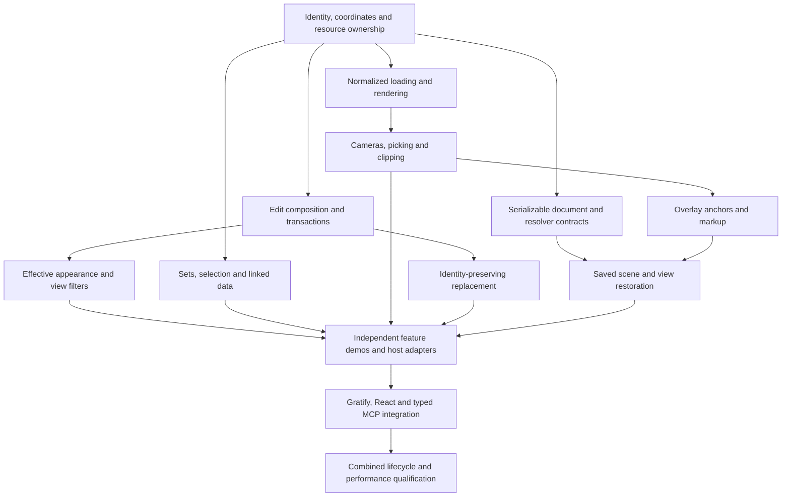

# Visualization implementation plan

## Read this first

This is the durable implementation plan for the September 7, 2026 visualization product brief. It retains the original scope and delivery sequence. The delivered prioritized alpha does not satisfy every P0 release requirement.

- [Original product brief](../../../../docs/plans/visualization/PRODUCT-BRIEF.md): exact source copy, including all benefits, F01–F27 stages, priorities, dependencies and acceptance outcomes. This remains the requirements baseline.
- [Current implementation status](STATUS.md): delivered increments, current constraints and qualification gaps.
- [Verification evidence](FINDINGS.md): actual checks, browser observations and limits; a demo route alone does not establish feature completion.
- [Planning history and decisions](../../../../docs/plans/visualization/README.md): exact committed plans, provenance and the explanation of the September 7 repair.
- [Parallel scheduling improvements](../../../../docs/plans/visualization/PARALLEL-WAVE-IMPROVEMENTS.md): concrete guidance for future authorized waves.

The repository-root PLAN.md concerns initial repository population and is a separate plan. This document was reconstructed on September 7 from the intact product brief and committed plans; it is not a claim to recover every uncommitted intermediate wave note.

## Product intent and implementation policy

Build a TypeScript/WebGL 2 library of composable BIM visualization capabilities. BOS is primary; bounded GLB, GLTF, OBJ and STL support belongs to the proposed V1. Application developers must be able to use the same public operations in an independent small viewer, a Gratify interface or a substantial React application. UI adapters consume the public API; they do not own hidden alternate behavior.

Preserve model identity across tables, selection, spatial presentation, edits and saved views. Keep features independent, reusable and testable, with explicit renderer and resource ownership. Reuse suitable licensed toolkit/viewer code and preserve notices. The source brief's product commitments, including default Gratify UI, actual MCP integration and measured performance qualification, remain requirements even where this alpha implements only part of them.

User implementation steering: deliver useful increments quickly, use available parallel capacity, postpone expensive weakly related work, and let the coordinator review and update the plan. Snowdon is the primary integration fixture. Each feature gets its own mini demo viewer and focused meaningful checks. Surface model and runtime errors early and visibly. Deferral changes scheduling; it does not erase requirements or turn an alpha into a completed V1 release.

## Original delivery sequence and release boundary

The following sequence is reproduced from section 7 of the product brief. Scheduling individual feature stages may cross milestone rows once their actual dependencies are ready.

This is a product dependency sequence, not a final agent assignment or a promise that every feature in a row can be built concurrently. Shared contracts must be agreed before dependent writers start.

| Milestone | Deliverable | Capabilities and readiness condition |
|---|---|---|
| M0 — Contracts and baseline | A tiny scene, package skeleton, identity/coordinate definitions, disposal rules and a repeatable measurement harness. | F01 and F27 foundations. Record what can be reused and establish named reference devices. Probe Gratify touch/focus early. |
| M1 — Useful model viewer | Snowdon opens and can be navigated. All five formats have bounded loading support and fixtures. | F02/F03/F04 and F10 basic environment; F11 basic telemetry. Parsing and scene contracts are stable. |
| M2 — Composable review | Selection, data colors, ghosting, linked table, default Gratify shell and touch navigation. | F05–F09, F26 first recipe. Core operations demonstrably work without UI. Start the React host here. |
| M3 — Spatial inspection | Sections, box clipping, layouts, two views and analytical points/paths/envelopes. | P0 stages of F12–F14 and F18. Picking, style and coordinate contracts cover these combinations. |
| M4 — Reproducible changes | Layered edits, one-object geometry replacement, scene/view saving, text markup, screenshots and thumbnails. | P0 stages of F15–F20. Define serializable contracts earlier; prove integrated restore now. |
| M5 — V1 integration gate | Simple animations, complete React app, real MCP demonstration, documentation and performance qualification. | P0 stages of F21/F23/F27 plus the existing milestones. Verify feature combinations and resource lifecycle. |
| M6 — Focused extensions | Advanced region slicing, room/minimap navigation, four views, richer edits, maps, enhanced lighting and voxels. | P1 increments selected in their dependency order, each with its own cost/benefit and regression evidence. |
| M7 — Specialist experiments | Progressive tracing, quantitative light adapters, stronger voxelization and other expensive analyses. | P2 work only after feasibility and capability boundaries are documented. |

### Critical ordering constraints

- **Identity precedes selection, persistence and comparison.** Render instance indices are an implementation detail, not a durable application key.
- **Coordinate meaning precedes maps, spatial findings and measurements.** Presentation offsets cannot silently become physical placement.
- **Style composition precedes feature combinations.** Selection, heat maps, ghosting, clipping and edit layers must agree on effective appearance.
- **Edit semantics precede geometry chains.** Replacement identity, transactions and undo must be settled before advanced mesh tools.
- **Serializable contracts precede saved scene UI.** Do not accumulate feature state as opaque renderer or widget objects and retrofit persistence afterward.
- **Overlay anchors precede persistent markup.** Camera movement, object transforms and source replacement must have defined effects on annotations.
- **Typed commands precede MCP transport.** Integration must reuse application commands rather than introduce a second behavior path.
- **A measured baseline precedes feature optimization.** Begin with the simplest correct picking, rendering and geometry operation; specialize when evidence supports it.

### V1 release boundary

The proposed V1 includes all P0 stages: BOS/GLB/GLTF/OBJ/STL loading; rendering and bulk updates; all basic camera modes; touch and themes; selection/heat maps/ghosting; basic environment and diagnostics; plane/box slicing; basic object arrangements; two views; basic edit layers and geometry replacement; saved scenes/views; analytical overlays and points of interest; text markup; images/thumbnails; basic animation examples; an initial BuildingModel recipe; actual MCP and React integrations; public documentation and verified performance profiles.

P1 and P2 features are not required to make a P0 module reusable. Their future requirements should influence small shared contracts where necessary, without introducing speculative systems into the first implementation.

## Original feature index

The IDs and priorities below are retained verbatim from the brief. Read each full feature section in the [requirements baseline](../../../../docs/plans/visualization/PRODUCT-BRIEF.md) before dispatch; this index does not replace its acceptance cases. Map results back to these IDs in STATUS.md and per-feature evidence.

- F01. Model identity and scene foundation — P0
- F02. File loading and fast opening — P0
- F03. Rendering and bulk object updates — P0
- F04. Cameras and configurable navigation — P0
- F05. Mobile, touch and input coexistence — P0
- F06. Hit testing and pointed-at objects — P0
- F07. Selection sets and linked data — P0
- F08. Appearance, ghosting and heat maps — P0
- F09. Default UI, theming and developer composition — P0
- F10. Environment and basic lighting — P0; enhanced effects P1
- F11. HUD and spatial navigation aids — P0 basics; P1 spatial navigation
- F12. Slicing and see-through inspection — P0 planes/box; P1 advanced regions
- F13. Exploded and arranged object layouts — P0 basic; P1 richer layouts
- F14. One, two and four views — P0 two-view; P1 four-view
- F15. Layered edit sets and undo/redo — P0 basic
- F16. Editable geometry chains and level of detail — P0 replacement; P1 editing/LOD
- F17. Scene saving and saved views — P0
- F18. Analytical overlays and clickable points of interest — P0
- F19. Persistent markup — P0 text; P1 drawing
- F20. Screenshots and thumbnails — P0
- F21. Basic animation and timelines — P0 examples; P1 richer authoring
- F22. Snowdon in an open map context — P1
- F23. MCP integration — P0 bounded integration and compelling demo
- F24. Advanced lighting, ray/path tracing and light simulation — P2
- F25. Voxelized representation — P1 bounds preview; P2 mesh-derived occupancy
- F26. BuildingModel workflow adapters and recipes — P0 first recipe; P1 expansion
- F27. Documentation, standalone demos and verification tools — P0 from the start

## Contracts and dependency graph

The current typed contracts and adapter limitations are recorded in [STATUS.md](STATUS.md). The original foundation decisions are preserved in [PLAN-82d7f41.md](../../../../docs/plans/visualization/history/PLAN-82d7f41.md). Do not infer a new contract revision from a progress summary.

## Wave ownership and scheduling

Use Parallel Wave and Platonic Coder. This session exposes four concurrent agent slots including the coordinator, so at most three workers can run. Re-check actual capacity in future sessions; nested agents consume capacity too.

The coordinator owns contracts, public exports, manifests/lockfiles, gallery registration/host, shared fixture server, aggregate plans/findings, shared builds, integration and publication. Workers own exclusive feature implementation, focused tests, a standalone demo and a checkpoint. Assign explicit paths and input/resource ownership before dispatch. Stage and commit under serialized turns; other independent coding can continue.

Keep a short queue of ready tasks tied to unmet feature stages. Dispatch a replacement assignment when a worker completes and its next prerequisites are checked; do not wait for every track to finish. A useful packet contains the original F-ID/stage and acceptance cases, agreed contract revision, writable paths, demo route, test command, performance impact, stop/reassess condition and next handoff. Prefer bounded tasks that can finish within one useful checkpoint. Investigate repeated failures once, preserve findings and partial work, then unblock or explicitly defer according to the user's scope.

Keep Snowdon browser/GPU checks centrally scheduled until measured resource capacity supports more. Workers can run scoped CPU tests concurrently only with stable inputs and separate outputs. Keep a fixture-loading and visible-error smoke gate early in each affected wave. Independent views should not each mount unrelated features just to demonstrate completion. Final combined checks still require stable inputs.

## Acceptance and benchmarks

Feature completion follows section 10 of the [brief](../../../../docs/plans/visualization/PRODUCT-BRIEF.md): public API behavior, meaningful smallest-fixture cases, standalone UI demo where relevant, correct combinations and cleanup, applicable browser checks, measured or explicitly inapplicable performance cost, current documentation/reference, and combined verification against stable inputs.

Use Snowdon as the primary integration and performance model without committing private model data. Check the real HTTP response, MIME, ZIP signature, exact source hash, metadata consistency and nonempty decoded geometry before accepting model loading. Keep negative fixtures for HTML fallback, truncation and cancellation. Record browser/runtime failures and limitations explicitly; an HTTP 200 or data-only test does not prove rendered success.

The original benchmark protocol and targets remain in brief section 8 and the foundation plan. The alpha protocol measures 10,000 distinct represented objects with 5 warmups and 20 samples, reporting p50/p95 CPU submission separately from next-RAF observations. Record model hash, browser, viewport and available hardware facts. Do not claim GPU/presentation completion from RAF or hardware performance from software WebGL functional checks. The 30 FPS and interaction targets require actual qualification.

## Unresolved work and decisions

Use STATUS.md for individual implementation gaps. Major remaining P0 qualification or behavior includes full saved scene/view state and restore combinations, broader analytical overlays, the default Gratify shell/theming, actual MCP transport/demo, first-person navigation and real mobile/hardware performance qualification. These remain open even though useful related APIs and demos exist.

Before resuming a deferred stage, bound its acceptance and cost: choose the saved-state migration and overlay anchors before unified persistence; select an MCP transport/client before claiming live integration; identify reference devices before performance or mobile release claims. Maps need coordinate registration and provider choices. Tracing and mesh-derived occupancy need separate feasibility evidence. Do not start speculative infrastructure merely to keep workers occupied.

## Maintaining this plan

Keep the original brief and committed history immutable. Add dated decisions with previous requirement, new scheduling or scope choice, rationale and user basis. Put rolling task state in STATUS.md or owned wave checkpoints. Preserve requirement IDs, dependencies, acceptance criteria and unresolved work when editing this plan. Before committing a plan change, inspect removed text and account for every requirement; moving material requires a working link and a retained source. On resumption or context compaction, reread this plan, current status, relevant original feature sections and owned checkpoints before writing.
